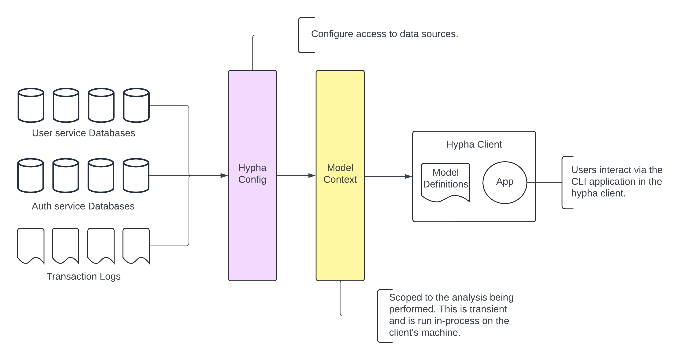

# Overview

The core concepts of Hypha are:

- [Sources](sources.md)
- [Models](models.md)

These concepts are used to define the data you want to retrieve, the shape of the data, and the source of the data. The overall system architecture is as follows:

<figure><figcaption></figcaption></figure>
