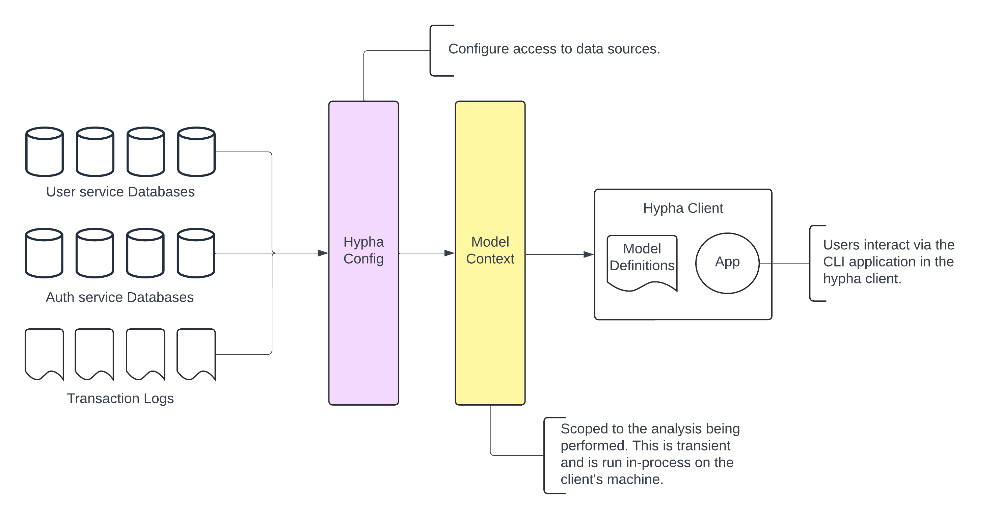

# HyphaDB Demo

This is guide to demonstrate how to use HyphaDB. There are a couple of concepts that we use in HyphaDB:

1. **Source**: A source is a data store that we want to query. You can configure multiple sources in HyphaDB via the `config.yaml` file. Currently supported sources are MongoDB, Postgres, and MySQL.

2. **Context**: A context is a the unit of data that we want to store in HyphaDB. It is a user defined query that we retrieve and collate from all configured sources. You define a context by creating a `*.context.sql` (SQL systems) or a `*.context.json` (NoSQL systems) file in the `contexts` directory.



The workflow is 1) configure sources in `config.yaml`, 2) build your context to query data from these sources, and 3) query the data locally via the HyphaDB CLI.

## Step 1: Configure Sources

The first step is to configure the sources that you want to query. You can configure sources in the `config.yaml` file. Here is an example configuration for a MongoDB source:

```yaml
sources:
  - name: mongo-db-us-west-1 # This has to be unique
    engine: mongodb
    connection:
      host: localhost
      port: 27117
      database: hyphadb
      username: root
      password: thisisnotarealpassword
      auth_source: admin
    contexts: 
      - users
      - orders
      - products
```

You can validate your configuration by running the following command:

```bash
hyphadb source validate
```

## Step 2: Create a Context

The next step is to create a context. The context directory, configurable with the `HYPHADB_CONTEXT_PATH` environment variable, contains all the contexts that you want to query. We don't support `select * from table` queries. You have to define the columns that you want to query. Here are some examples of contexts for both SQL and NoSQL systems.

```sql
select 
    transactions.transaction_id,
    transactions.user_id,
    transactions.product_id,
    transactions.quantity,
    transactions.price,
    transactions.transaction_date,
    transactions.payment_method,
    transactions.shipping_address,
    transactions.order_status,
    transactions.discount_code,
    t1.transaction_id as transaction_id1,
    t2.transaction_id as transaction_id2
from
    transactions
inner join
    transactions as t1
on 
    transactions.transaction_id = t1.transaction_id
inner join
    transactions as t2
on
    transactions.transaction_id = t2.transaction_id
where
    transactions.price < 100;
```

```json
{ "login_attempts": { "$gt": 1 } }
```

You can build your context by running the following command:

```bash
hyphadb context build
```

## Step 3: Query Data

Once your context is built locally, you can query the data by opening a REPL:

```bash
hyphadb repl

# You can also specify the type of output: csv, table, or markdown. Defaults to table.
hyphadb repl --output-format csv
```
